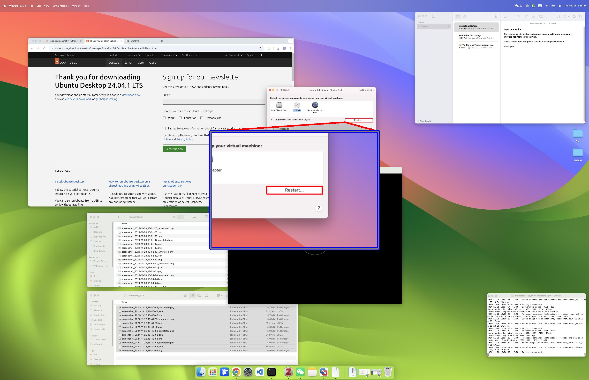

# Building Your First GUI Agent

In this tutorial, we'll walk through the process of building a GUI agent that can interact with desktop applications like a human operator.

## Why GUI Agents?

Traditional command-line automation is limited by the APIs that tools expose. GUI agents, on the other hand, can:
- Click, type, and navigate any interface
- Work with legacy software
- Automate visually-driven workflows



## Core Components

A basic GUI agent consists of:
1. **Vision Module**: For understanding screen content
2. **Planning Module**: For breaking down tasks
3. **Action Module**: For executing GUI interactions
4. **Memory**: For maintaining context

## Example Code

Here's a simple example of how a GUI agent might work:

```python
class GUIAgent:
    def __init__(self):
        self.vision = VisionModule()
        self.planner = PlanningModule()
        self.executor = ActionExecutor()
    
    def execute_task(self, task):
        # 1. Observe the screen
        screen = self.vision.capture()
        
        # 2. Plan the next action
        action = self.planner.plan(task, screen)
        
        # 3. Execute the action
        self.executor.perform(action)
```

## Conclusion

GUI agents represent an exciting frontier in AI automation. Stay tuned for more tutorials!
